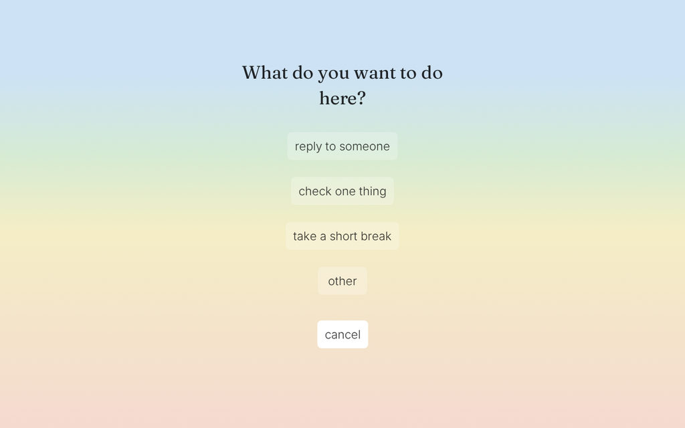
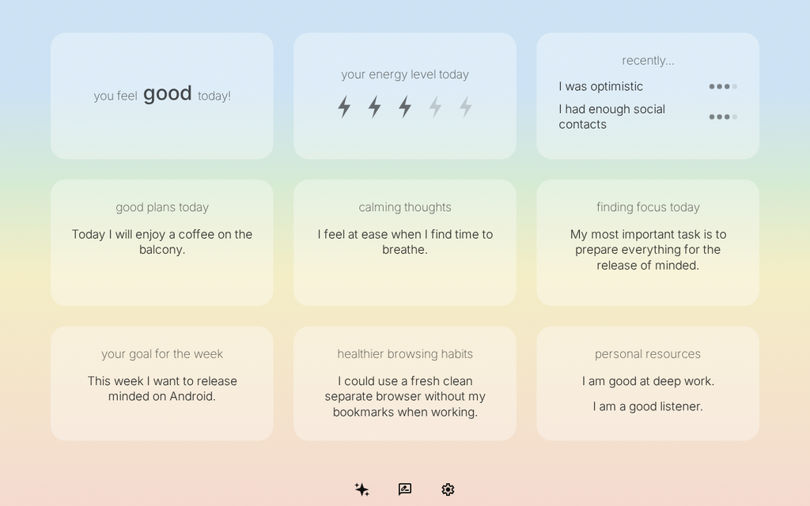
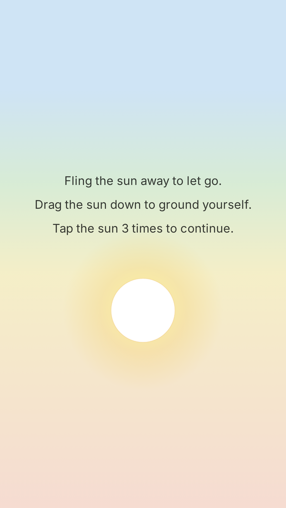
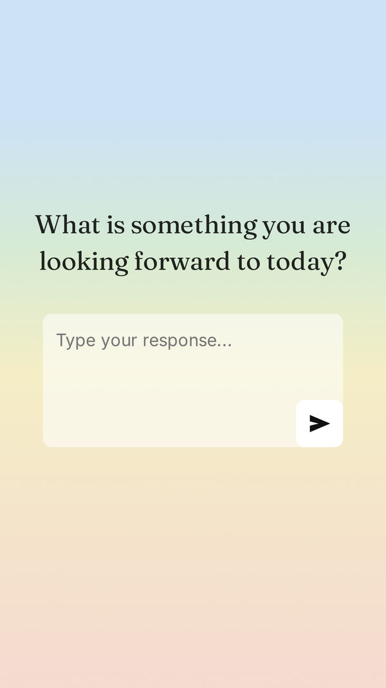
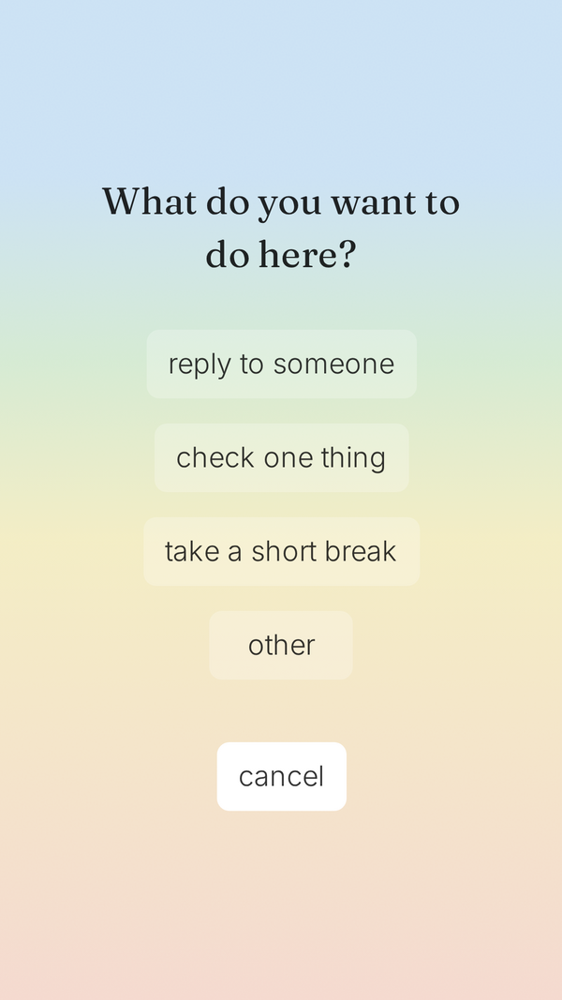

# minded

A mindfulness layer that sits between you and the apps and sites that pull you in. minded interrupts doom-scrolling, social-media compulsion, and procrastination with short interventions — a breath, a check-in, a moment to ask whether you actually meant to open this.

- **Browser extension** for Chrome and Firefox (Manifest V3)
- **Android app** (native Kotlin host + shared web UI)
- Shared SolidJS codebase across platforms

<p align="center"><b>Browser extension</b></p>

<table>
  <tr>
    <td width="50%"></td>
    <td width="50%"></td>
  </tr>
  <tr>
    <td align="center"><em>A pause before the scroll — name what you actually came to do.</em></td>
    <td align="center"><em>A calm dashboard of the day's intentions and check-ins.</em></td>
  </tr>
</table>

<p align="center"><b>Android</b></p>

<table>
  <tr>
    <td width="33%"></td>
    <td width="33%"></td>
    <td width="33%"></td>
  </tr>
  <tr>
    <td colspan="3" align="center"><em>The same gentle nudges on Android — a breath, a check-in, a moment to ask whether you meant to open this.</em></td>
  </tr>
</table>

## Install

- **Chrome / Edge / Brave** — [Chrome Web Store](https://chromewebstore.google.com/detail/minded/obghjflblojheamhnchaklenibffehjk)
- **Android** — [Google Play](https://play.google.com/store/apps/details?id=com.minded.minded)
- **Firefox** — load `dist/` as an unpacked extension after building locally (AMO listing pending)

Learn more at [minded.today](https://minded.today).

## Develop

Requires Node.js 21+ and npm.

```bash
cd extension
npm install
npm start          # browser-extension dev build (watches files, output in dist/)
npm run startDroid # android dev build (writes into android/app/src/main/assets/web/)
```

Load the extension in Chrome by opening `chrome://extensions`, enabling Developer mode, and pointing **Load unpacked** at `extension/dist/`.

For the Android app, open `/android` in Android Studio after running `startDroid` once.

## Build

```bash
cd extension
npm run build      # production browser extension → dist/ + minded.zip
npm run buildDroid # production android assets
```

## Test

```bash
cd extension
npm test           # jest
npm run lint       # eslint --fix
```

Run a single test: `npx jest path/to/test.spec.ts`.

## Repository layout

```
extension/      Browser-extension build (Vite + CRXJS) and shared SolidJS UI
android/        Native Android host (Kotlin) wrapping the shared web UI
landing-page/   Marketing site (Astro) at minded.today
common/         Shared assets (logos, icons)
docs/           Architecture and design notes
```

The web UI under `extension/src/shared/` is reused across all platforms. Platform-specific data access goes through the **dataInterface pattern** documented in [`CLAUDE.md`](./CLAUDE.md) — that file is the best entry point for understanding the architecture.

> **iOS note:** iOS code paths exist under `extension/src/ios/` but are not actively developed. Real interventions on iOS are blocked by platform restrictions on inspecting other apps. New features should target the browser extension and Android.

## Contributing

See [CONTRIBUTING.md](./CONTRIBUTING.md). Bug reports, feature ideas, and PRs are welcome.

## Security

Found a vulnerability? Please don't open a public issue — see [SECURITY.md](./SECURITY.md).

## License

[MIT](./LICENSE) © Johannes Millan
