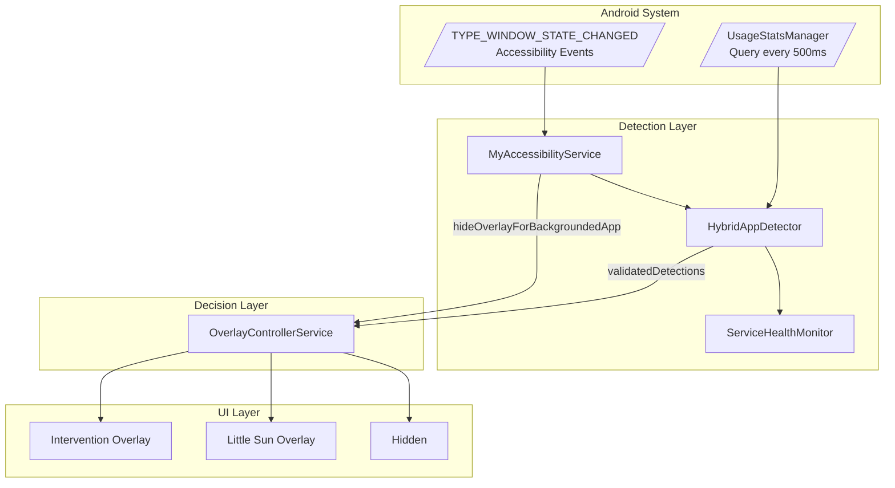
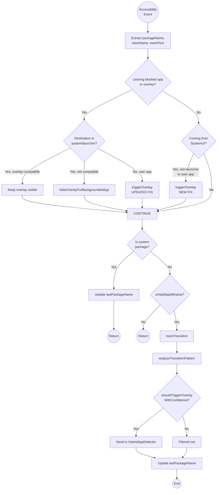
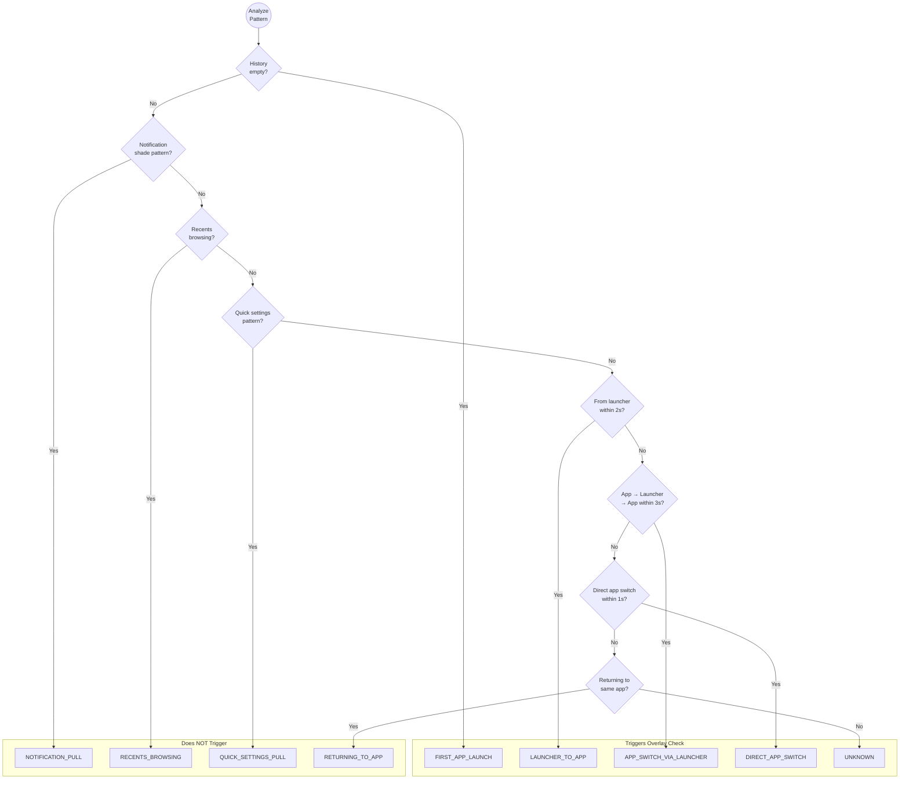
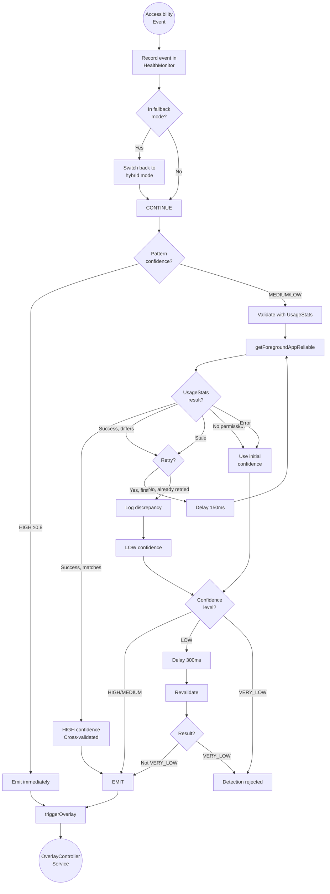
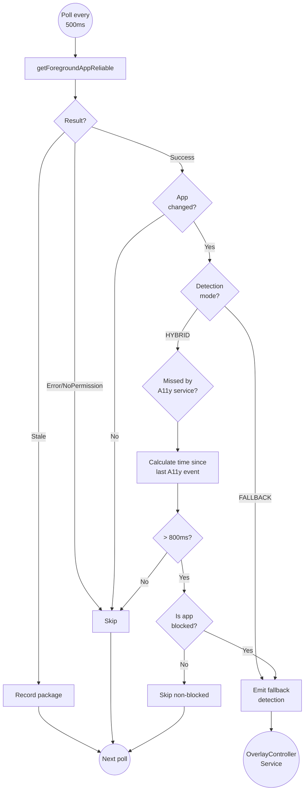
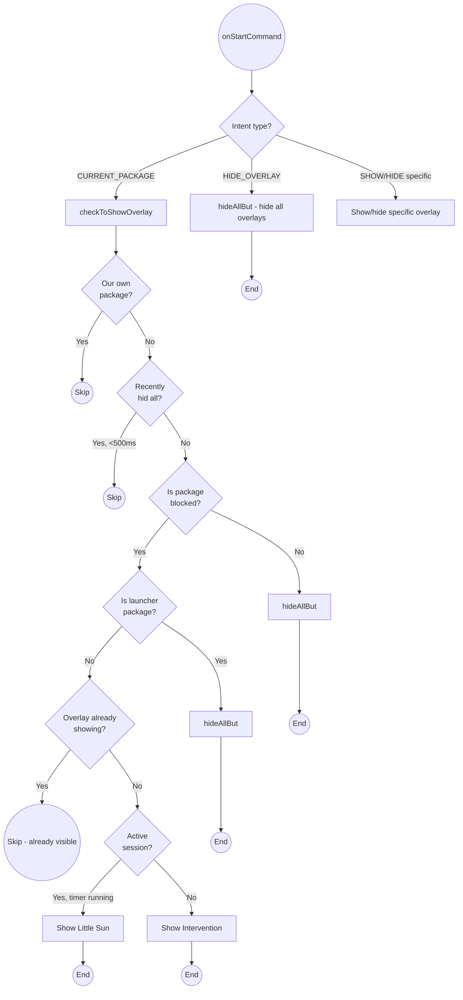
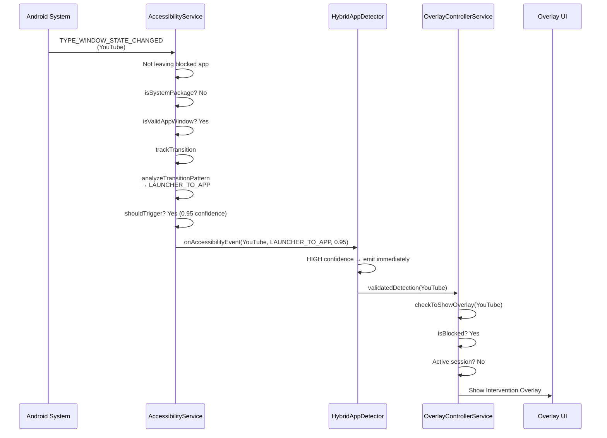
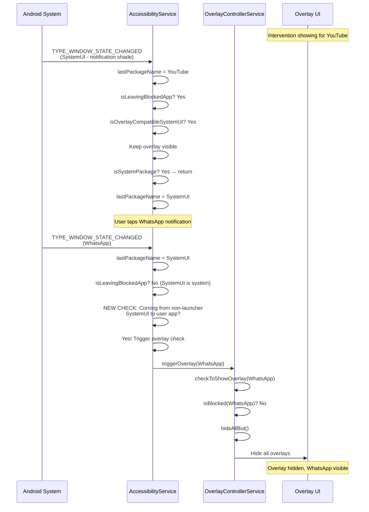

# Android App Detection Flow

This document explains how the minded Android app detects foreground app changes and decides when to show/hide the intervention overlay.

## High-Level Overview

## Detailed AccessibilityService Flow

## Pattern Detection Logic

## HybridAppDetector Validation Flow

## UsageStats Fallback Detection

## OverlayControllerService Decision Logic

## Complete End-to-End Flow Example

### Scenario: User opens blocked app (YouTube) from launcher

### Scenario: User opens WhatsApp from notification (THE BUG FIX)

## Confidence Levels

| Level | Score Range | Action |
|-------|-------------|--------|
| HIGH | ≥ 0.8 | Act immediately, no validation needed |
| MEDIUM | 0.5 - 0.79 | Validate with UsageStats, act if confirmed |
| LOW | 0.3 - 0.49 | Validate, retry after 300ms if uncertain |
| VERY_LOW | < 0.3 | Ignore detection |

## Pattern Confidence Scores

| Pattern | Confidence | Triggers Overlay? |
|---------|------------|-------------------|
| FIRST_APP_LAUNCH | 0.95 | Yes |
| LAUNCHER_TO_APP | 0.95 | Yes |
| APP_SWITCH_VIA_LAUNCHER | 0.90 | Yes |
| DIRECT_APP_SWITCH | 0.85 | Yes |
| UNKNOWN | 0.50 | Depends on validation |
| RETURNING_TO_APP | 0.20 | No |
| NOTIFICATION_PULL | 0.15 | No |
| QUICK_SETTINGS_PULL | 0.15 | No |
| RECENTS_BROWSING | 0.10 | No |
